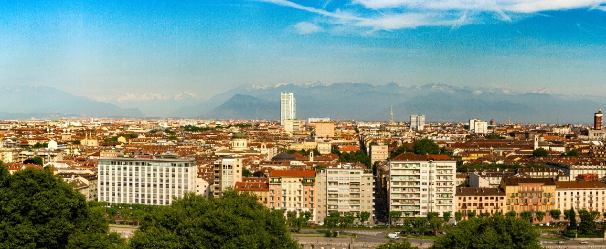
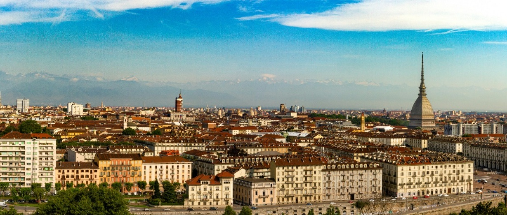
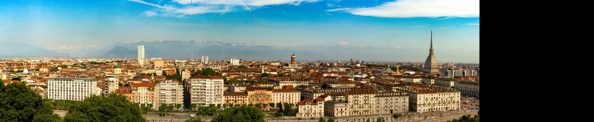

# Panorama Stitching (C++)

## Goal

Build a simple panorama stitching pipeline  
using projective geometry and homography estimation.

---

## Key Idea

Two images of the same scene can be aligned  
using a homography:


x' = Hx


If correct correspondences are found,  
a single projective transform maps one image onto another.

---

## Pipeline

The pipeline is implemented as a sequence of processing steps:

- detect keypoints and compute descriptors
- match descriptors between images
- filter matches using RANSAC
- estimate homography
- warp image using the estimated transform
- blend overlapping regions

The same pipeline is applied in two ways:

- custom implementation
- OpenCV implementation (`cv::findHomography`)

The difference lies in how the homography is estimated.

---

## Implementation Details

### Custom Pipeline

The homography is estimated from a set of point correspondences between images by solving a system of linear equations. A linear method (Direct Linear Transform, DLT) is used to recover the transformation matrix up to scale.

To improve numerical stability, the input points are normalized prior to estimation. This reduces numerical errors when solving the system.

Since real-world correspondences typically contain outliers, the estimation is performed within a robust framework. A RANSAC-based approach is used, where minimal subsets of correspondences are iteratively sampled to compute candidate models, which are then evaluated against all data.

The quality of each model is determined by the number of inliers, defined using a reprojection error threshold. The best model is selected, and the final homography is re-estimated using all inliers.

---

### OpenCV Pipeline

The OpenCV-based approach uses the built-in function `cv::findHomography`, which internally performs both normalization and robust estimation.

Given a set of point correspondences, the function applies a RANSAC-based procedure to estimate the homography while handling outliers.

---

## Result

- both methods produce visually similar panoramas
- alignment is correct in both cases
- differences are minor and mostly visible in edge regions

---

## Key Observations

- homography quality depends primarily on match quality
- RANSAC has a stronger impact than the specific DLT implementation
- normalization improves numerical stability but does not fix bad matches
- limiting the number of matches can improve robustness
- simple implementations can perform comparably to library solutions

---

## Visualization

### Input Images




---

### Result: Custom Homography



---

### Result: OpenCV Homography


---

## Tests

Unit tests cover:

- homography estimation on synthetic data
- consistency between custom and OpenCV implementations

## Project Structure

```
include/
  core/        → Vec3, Mat3
  geometry/    → points, lines, operations
  transform/   → affine transforms
  projective/  → homography

src/           → implementation

tests/         → unit tests (GoogleTest)

viz/           → visualization (OpenCV)
```

---

## Build with visualization

```
mkdir build
cd build
cmake -DBUILD_VISUALIZE=ON ..
cmake --build .
```

---

## Build with tests

```
mkdir build
cd build
cmake -DBUILD_TESTING=ON ..
cmake --build .
ctest -V
```

---

## Run

```
./visualize img1.jpg img2.jpg
ctest -V
```

---

## Roadmap

- camera model (3D → 2D projection)
- epipolar geometry
