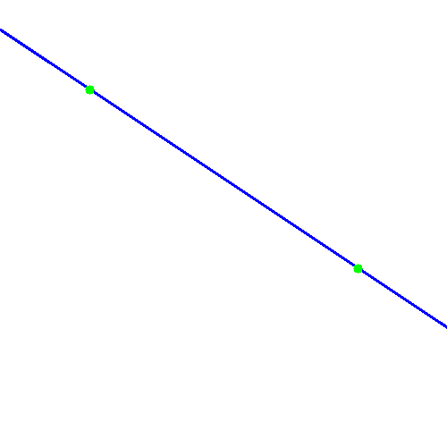
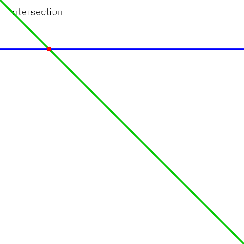
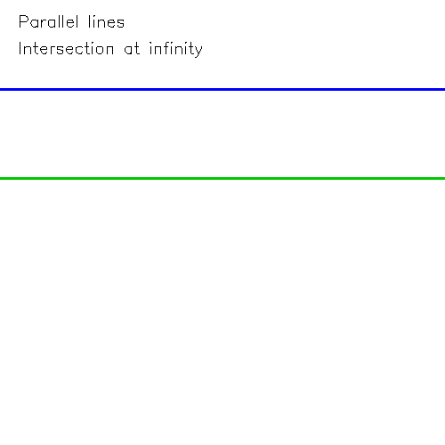
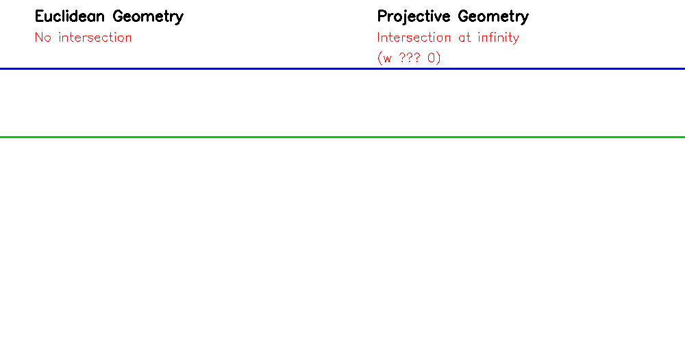
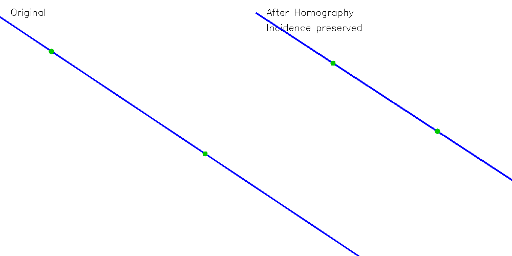

# Projective Geometry Basics (C++)

## Goal

Understand how basic geometric operations used in computer vision  
can be expressed using linear algebra and homogeneous coordinates.

---

## Key Idea

In projective geometry:

- a point is a vector `(x, y, w)`
- a line is a vector `(a, b, c)`

Their relationship is defined by:

```
a x + b y + c w = 0
```

This allows all geometric operations to be expressed using:

- dot product → incidence (point lies on line)
- cross product → construction (join / meet)

---

## Representation

```cpp
struct Vec3 {
    double x, y, z;
};

using Point = Vec3; // (x, y, w)
using Line  = Vec3; // (a, b, c)
```

---

## Core Operations

| Operation | Formula         | Meaning                 |
|----------|----------------|-------------------------|
| Incidence | dot(l, p) = 0 | Point lies on line      |
| Join      | l = p1 × p2   | Line through two points |
| Meet      | p = l1 × l2   | Intersection of lines   |

---

## Transformations

### Euclidean / Affine

```
Transform2D::translation(...)
Transform2D::rotation(...)
Transform2D::scale(...)
```

### Projective (Homography)

```
x' = Hx
l' = H^{-T} l
```

Projective transformations preserve incidence relationships  
between points and lines.

---

## Key Property

```
p ∈ l  →  H(p) ∈ H(l)
```

A point lying on a line remains on the corresponding transformed line.

---

## Visualization

### Join (line through two points)



### Meet (intersection of lines)



### Parallel lines



Parallel lines intersect at infinity (w ≈ 0) in projective space.

### Euclidean vs Projective



### Homography



---

## Tests

Unit tests cover:

- incidence correctness
- join/meet consistency
- behavior of parallel lines
- normalization of homogeneous coordinates
- transformation correctness
- incidence preservation under homography

Example:

```
EXPECT_TRUE(incidence(p, l));
EXPECT_TRUE(isAtInfinity(p));
```

---

## Project Structure

```
include/
  core/        → Vec3, Mat3
  geometry/    → points, lines, operations
  transform/   → affine transforms
  projective/  → homography

src/           → implementation

tests/         → unit tests (GoogleTest)

viz/           → visualization (OpenCV)
```

---

## Build

```
mkdir build
cd build
cmake ..
make
```

---

## Run

```
./tests
./visualize
```

---

## Applications

This library demonstrates the foundations of:

- homography
- camera projection models
- vanishing points
- multi-view geometry

---

## Roadmap

- homography estimation from point correspondences
- camera model (3D → 2D projection)
- epipolar geometry