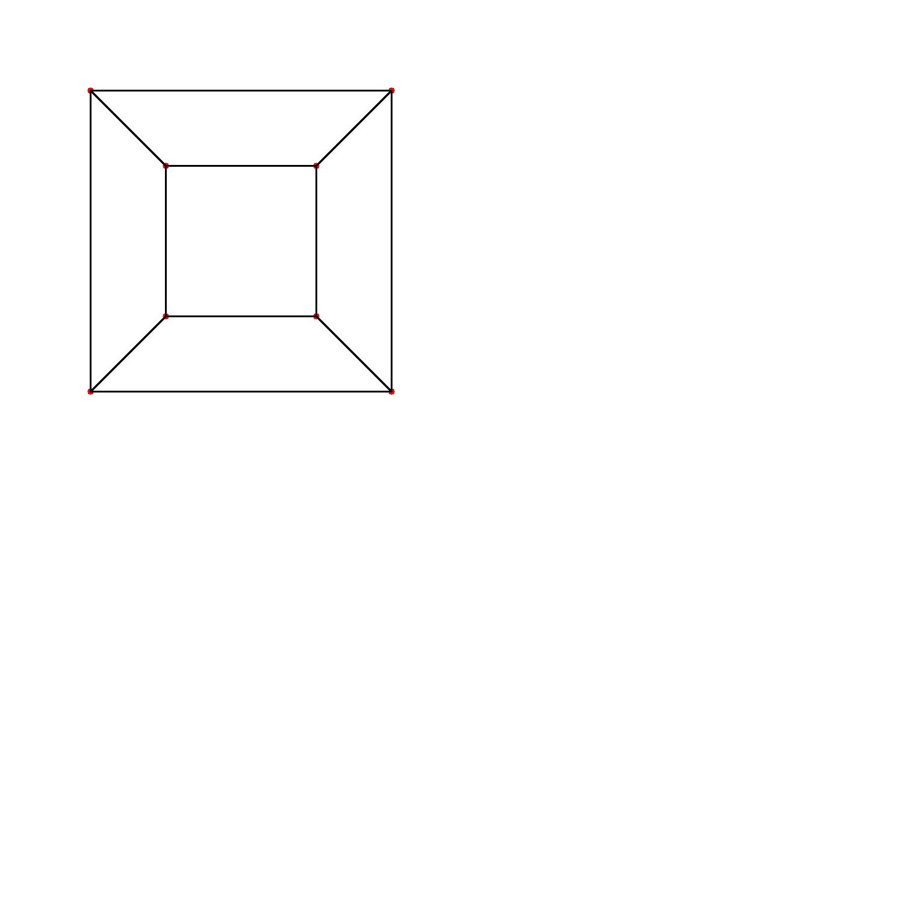
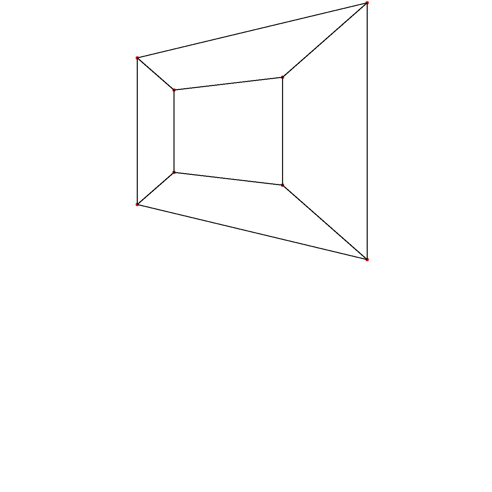

# Camera Projection Model

## Goal

Understand how a 3D scene is projected onto a 2D image using the pinhole camera model.

---

## Key Idea

A camera image is a 2D projection of a 3D scene.

The pinhole camera model describes this process mathematically using projective geometry.

In homogeneous coordinates, the projection is written as:

```math
x \sim K[R|t]X
```

where:

- \(X = (X, Y, Z, 1)^T\) — 3D point in world coordinates
- \(R, t\) — camera pose (rotation and translation)
- \(K\) — intrinsic camera matrix
- \(x = (u, v, 1)^T\) — projected image point

The intrinsic matrix is:

```math
K =
\begin{bmatrix}
f_x & 0 & c_x \\
0 & f_y & c_y \\
0 & 0 & 1
\end{bmatrix}
```

where:
- \(f_x, f_y\) — focal lengths;
- \(c_x, c_y\) — principal point coordinates.

A key property of perspective projection is division by depth:

```math
x_n = X/Z
```

```math
y_n = Y/Z
```

This creates the perspective effect:
- distant objects appear smaller;
- image scale depends on depth;
- parallel lines visually converge.

Unlike affine transforms, perspective projection is nonlinear because of the division by \(Z\).

---

## Pipeline

The projection pipeline is implemented as a sequence of geometric operations:

1. transform a 3D point into camera coordinates using rotation and translation;
2. perform perspective division;
3. apply camera intrinsics;
4. obtain final image coordinates.

---

## Implementation Details

### Perspective Projection

A 3D point is first transformed into camera coordinates:

```math
X_c = RX + t
```

The point is then projected onto the normalized image plane using perspective division:

```math
x_n = X_c / Z_c
```

```math
y_n = Y_c / Z_c
```

Finally, camera intrinsics convert normalized coordinates into pixel coordinates:

```math
u = f_x x_n + c_x
```

```math
v = f_y y_n + c_y
```

---

### Camera Extrinsics

The camera pose is represented using:
- rotation matrix \(R\)
- translation vector \(t\)

Implemented rotations:
- rotationX
- rotationY
- rotationZ

---

### Visualization

The projection model is visualized using a simple wireframe cube.

The demo shows:
- perspective scaling with depth;
- camera translation effects;
- camera rotations around different axes.

---

## Result

The visualization demonstrates expected geometric behavior:
- distant cube faces appear smaller;
- rotating the camera changes projected image geometry;
- translating the camera shifts image coordinates.

---

## Key Observations

- perspective projection depends nonlinearly on depth;
- focal length controls image scale and field of view;
- camera translation changes projected position;
- camera rotation changes image geometry;
- perspective effects emerge naturally from homogeneous projection and division by depth.

---

## Visualization

### Input Geometry

A synthetic 3D wireframe cube is used as input geometry.

---

### Initial Cube Projection

Projection using identity camera pose:



---

### Camera Rotation

Projection after applying camera rotation:



---

## Tests

Unit tests cover:

- center projection;
- perspective division;
- depth scaling;
- camera translation;
- camera rotations.

## Project Structure

```
include/
  core/        → Vec3, Mat3, constants
  geometry/    → points, lines, geometric operations
  transform/   → 2D affine transforms
  projective/  → homography estimation
  camera/      → intrinsics, extrinsics, projection

src/           → implementation

tests/         → unit tests (GoogleTest)

viz/           → visualization and projection demos (OpenCV)
```

---

## Build with visualization

```
mkdir build
cd build
cmake -DBUILD_VISUALIZE=ON ..
cmake --build .
```

---

## Build with tests

```
mkdir build
cd build
cmake -DBUILD_TESTING=ON ..
cmake --build .
ctest -V
```

---

## Run

```
./visualize
ctest -V
```

---

## Roadmap

- camera calibration
- epipolar geometry
- essential / fundamental matrix
- triangulation
- stereo reconstruction
- multi-view geometry 
